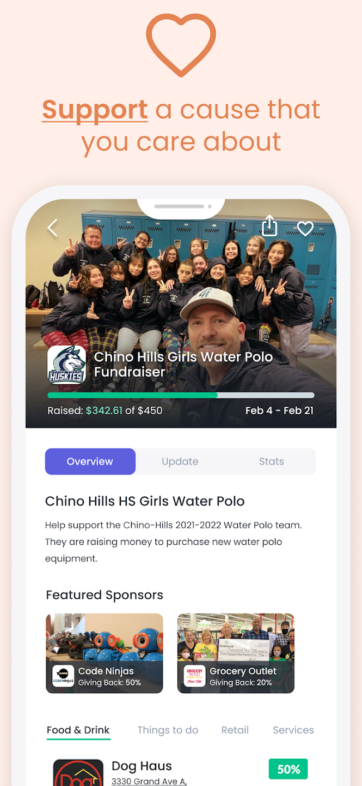

# ThinknLocal

##### Connect with your community and support local causes while you shop!

##### Thinknlocal helps community residents and local consumers give back to non-profit organizations and schools by simply doing what they do everyday --shop!

##### Users can support local businesses and worthy fundraising causes with each shopping trip! Simply upload receipts inside the thinknlocal app to instantly contribute to the local fundraiser of your choice - at no extra cost to you!

You can download this app using the following links:
### PlayStore:
https://play.google.com/store/apps/details?id=com.thinknlocal.Thinknlocal&hl=en_SG

### AppStore:
https://apps.apple.com/us/app/id1524846479

&nbsp;  
  

&nbsp;  
  
